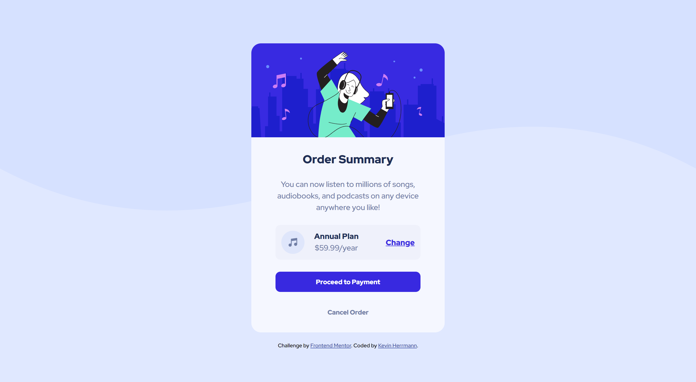

# Frontend Mentor - Order summary card solution

This is a solution to the [Order summary card challenge on Frontend Mentor](https://www.frontendmentor.io/challenges/order-summary-component-QlPmajDUj). Frontend Mentor challenges help you improve your coding skills by building realistic projects. 

## Table of contents

- [Overview](#overview)
  - [The challenge](#the-challenge)
  - [Screenshot](#screenshot)
  - [Links](#links)
- [My process](#my-process)
  - [Built with](#built-with)
  - [What I learned](#what-i-learned)
- [Author](#author)

## Overview

### The challenge

Users should be able to:

- See hover states for interactive elements

### Screenshot

### Links

- Solution URL: [https://github.com/kevinx9000/order-summary-component](https://github.com/kevinx9000/order-summary-component)
- Live Site URL: [https://kevinx9000.github.io/order-summary-component](https://kevinx9000.github.io/order-summary-component)

## My process

### Built with

- Flexbox
- Mobile-first workflow

### What I learned

This is the first time that I have tried a mobile-first workflow. My understanding is that it's the industry standard to do so. But admittedly, I found it more difficult than starting with a desktop workflow first. Perhaps with more practice I'll get better and prefer it.

## Author

- Frontend Mentor - [@kevinx9000](https://www.frontendmentor.io/profile/kevinx9000)

